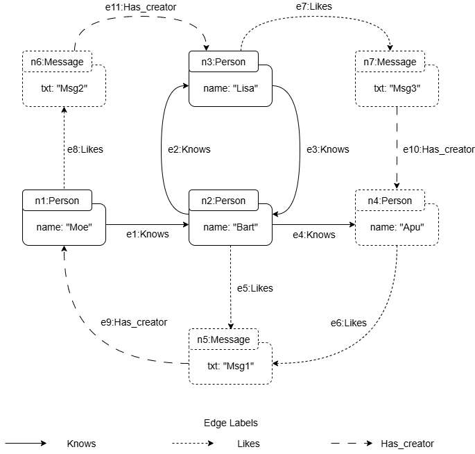

# PathDB

PathDB is an application written in Java that allows **Regular Path Queries (RPQs)** to be evaluated on **property graphs** loaded in main memory (RAM). The main feature of PathDB is the use of a **path algebra** for query evaluation instead of using common algorithms (as most graph database systems do). Therefore, PathDB generates evaluation trees that can be easily manipulated to perform optimizations.

---

## Getting Started (Hello Query in 3 Steps)

##### 1. Install Java 18 or higher
You can download the minimum version by [clicking here](https://www.oracle.com/java/technologies/javase/jdk18-archive-downloads.html).

##### 2. Download the PathDB executable
The current version of PathDB works as a command-line application.
The executable `PathDB.jar` of the latest release can be donwloaded from [this link](https://github.com/dbgutalca/PathDB/releases/tag/V0.3) .

##### 3. Run PathDB with the example graph and try a query

```bash
$ java -jar PathDB.jar
```

Basic query example:

```
MATCH TRAIL p = (x)-[Knows*]->(y) RETURN LABEL(FIRST()), LABEL(LAST()), x.name, y.name LIMIT 2;
```

Expected result:

```
┌──────────┬───────────────┬───────────────┬──────────────┬──────────────┐
│    #     │ LABEL(FIRST())│ LABEL(LAST()) │    x.name    │    y.name    │
├──────────┼───────────────┼───────────────┼──────────────┼──────────────┤
│    1     │    Person     │    Person     │     Moe      │     Moe      │
│    2     │    Person     │    Person     │     Bart     │     Bart     │
└──────────┴───────────────┴───────────────┴──────────────┴──────────────┘
```

---

## Test graph included

The test graph provided by PathDB is a very small representation of a social network. It has the following basic structure:
- Node types: Person(name), Message(txt).
- Edge types: Knows(Person, Person), Likes(Person, Message), and Has_Creator(Message, Person).

The graph contains a total of **7 nodes** and **11 edges** and looks like this:
<div align="center">
  
</div>

---

## Basic query examples

Although PathDB has its own language, it is based on **GQL**. Some basic query examples to try are as follows:

```
MATCH p = (a)-[Knows*]->(b) RETURN a.name, b.name;

MATCH p = (x)-[Knows.Likes]->(y) WHERE x.name = "Bart" LIMIT 1;
```

More complex examples are shown below:

```
MATCH WALK p = (x)-[HasCreator?.Knows*.Likes]->(y) WHERE p.LENGTH < 4 AND NODE(2).name = "Bart" RETURN p;

MATCH ACYCLIC p = (x)-[HasCreator?.Knows*]{..6}->(y) WHERE x.name = "Moe" OR x.txt = "Msg1" RETURN p;
```

---

## Upload your graph

If you want to use your own data, you must prepare the files in **PGDF format** (one for nodes and another for edges).

Example of nodes (`nodes.pgdf`):

```
@id|@label|name
n1|Person|Moe
n2|Person|Bart
n3|Person|Lisa
```

Example of edges (`edges.pgdf`):

```
@id|@label|@dir|@out|@in
e1|Knows|T|n1|n2
e2|Knows|T|n2|n3
```

Load the graph with:

```bash
$ java -jar PathDB.jar -n nodes.pgdf -e edges.pgdf
```

*Note: At this time, the order of the files as parameters is important for PathDB to run correctly.*

---

## PathDB Query Language (Syntax and semantics)

A complete query accepted by PathDB consists of the following parts:

```
MATCH <PathRestrictor> <PathPattern> <ConditionStatement> <ReturnStatement> <LimitStatement> ;
```

##### 1. MATCH (required)
Every PathDB query must begin with the reserved word `MATCH`. This indicates that you want to perform a pattern search in the graph.

##### 2. <PathRestrictor> (optional)
After `MATCH`, you can include any of the following restrictor clauses:

- **WALK** → No restriction. Allows nodes and edges to be repeated.
- **TRAIL** → Allows nodes to be repeated, but **not edges**. This is the default restrictor.  
- **ACYCLIC** → The path cannot have cycles (no node is repeated).
- **SIMPLE** → No node is repeated except for the first and last, which may be the same.  

A path restrictor clause allows to filter the paths computed by a query. It is important to mention that WALK is a dangerous option when a graph contains cycles as a query evaluation can be infinite.   

##### 3. <PathPattern> (required)
It is defined as follows:

```
<pathVar> = (<startNode>)-[<RegExp>]{..n}->(<endNode>)
```

- `<pathVar>` → A variable to identify the set of paths returned by the path query. A variable is a string without spaces.
- `<startNode>` → A variable to identify the start node of the path pattern. 
- `<endNode>` → A variable to identify the end node of the path pattern.  
- `<RegExp>` → A regular expression that defines the structure of the paths to be matched. 
- `{..n}` → Number of repetitions of recursive operators (optional and default 4).

Basic regular expression are an edge label (e.g. `knows`) or a negated edge label (e.g. `!knows`). Complex regular expression are concatenation (e.g. `(Knows . Likes)`), alternation (e.g. `(Knows | Likes)`), Kleene star (e.g. `(Knows)*`), positive closure (e.g. `(Knows)+`), and optional (e.g. `(Knows)?`).   

#### 4. <ConditionStatement> (optional)
PathDB allows you to define conditions that the components of a path must meet in order for the results to be valid. All conditions have the following form:

```
Function <operator> Value
```

The variable depends on the name given to the path, start node, and end node.

The functions supported by PathDB are: `FIRST().property`, `LAST().property`, `NODE(#).property`, `EDGE(#).property`, `LABEL(FIRST())`, `LABEL(LAST())`, `LABEL(NODE(#))` and `LABEL(EDGE(#))`.

Value comparison operators can be: `=`, `!=`, `>`, `>=`, `<`, `<=`.

Path conditions can be grouped using parentheses and Boolean operators such as `AND` and `OR`. A complete example from this section could be:

```...
 WHERE (FIRST().property = "something" AND LAST().property >= 100) OR LABEL(NODE(2)) = "Person" ...
```

#### 5. ReturnStatement (required)
Information can be extracted from the path using variables, properties, and functions. PathDB supports the following calls: `variable`, `variable.property`, `FIRST()`, `FIRST().property`, `LAST()`, `LAST().property`, `NODE(unsignedInteger)`, `NODE(unsignedInteger).property`, `EDGE(unsignedInteger)`, `EDGE(unsignedInteger.property`, `LABEL(NODE(unsignedInteger))`, `LABEL(EDGE(unsignedInteger))`, `LABEL(FIRST())`, `LABEL(LAST())'`.

#### 6. LimitStatement (optional)
It is possible to limit the number of results you want to obtain. To do this, simply write `LIMIT #`, where `#` is a positive integer. 

#### Complete example
A complete example looks like this:
```
MATCH ACYCLIC p = (x)-[HasCreator?.Knows*]{..6}->(y) WHERE x.name = “Moe” OR x.txt = “Msg1” RETURN p LIMIT 100;
```

---

## Contributors
* Renzo Angles, Universidad de Talca, Chile.
* Roberto García, Universidad de Talca, Chile.
* Sebastián Ferrada, Universidad de Chile, Chile.
* Vicente Rojas, Universidad de Talca, Chile.

---

## Funding
This development was funded by the **FONDECYT** project 1221727.  

---

## License
This software is distributed under the **Apache License 2.0**.  
More information at: [http://www.apache.org/licenses/LICENSE-2.0](http://www.apache.org/licenses/LICENSE-2.0)
