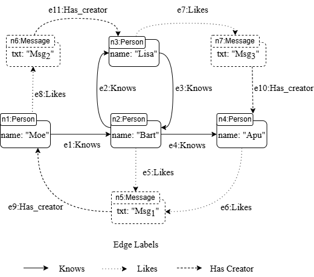
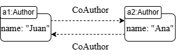

# PathDB

PathDB is a Java-based graph database designed for loading and querying data in memory. It uses Regular Path Queries (RPQ) and a closed path algebra to process path queries.

#### Requirements

Before running PathDB, you must make sure you have the following requirements installed:
* [Java 18](https://www.oracle.com/java/technologies/javase/jdk18-archive-downloads.html) (or above).
* [Maven](https://maven.apache.org/download.cgi).

#### Preliminaries 

The current structure of PathDB for handling nodes and edges is based on a property graph. Nodes must have an ID and a label, and optionally, properties can be added. For edges, they must currently have 4 attributes: label, direction, source node, and target node, but they do not support additional properties.

The language used by PathDB is based on GQL and has the following structure: `(x{prop:value})-[RE]->(y{prop:value});`. For now, PathDB only allows filtering one property per node, for example: `(x{name:Juan})-[knows*]->(y{name:Pedro});`.

Additionally, a regular expression can be formed using the following operations supported by PathDB:

```ANTLR4
expression: label                   // Single Label
    | '!' label                     // Negation
    | '(' expression ')'            // Parenthesis
    | expression '?'                // Optional
    | expression '+'                // Plus
    | expression '*'                // Kleene
    | expression '.' expression     // Concatenation
    | expression '|' expression     // Union
    ;   
```

With these operations available, an example of a regular expression accepted by PathDB would be `knows+|(likes.hasCreator)+`.

#### Running PathDB

Once the requirements are installed, you can download our latest release by [clicking here](). You will get a file with a `.jar` extension. To run it, open a terminal and navigate to where `PathDB.jar` is located.

PathDB has two execution arguments that are optional, but if provided, both must be included.

If you do not have a test database and want to use the default one, simply run PathDB as follows:

```bash
$ java -jar PathDB.jar
```

If you have a database that follows the structure mentioned in the [preliminaries](#preliminaries), you can load it into PathDB using the following command:

```bash
$ java -jar PathDB.jar -n NodesFile -e EdgesFile
```

If you have already loaded a database or are using one of the default ones, we recommend using the `/help` command to see all the configuration options available in PathDB.

#### Demo Datasets

For this release of PathDB we test with two datasets

##### Social Network

This dataset is a integrated into the application as a property graph simulating a social network. Each node has: An identigier, a label and a property. Each edge has: An identifier and a label.

###### Nodes
- Person(name)
- Message(txt)
###### Edges
- Knows (Person, Person)
- Likes (Person, Message)
- Has_Creator (Message, Person)

the property graph contains **7 nodes** and **11 edges** and looks as follows:
<div align="center">
  
</div>


#### Sample Query

This property graphs allow both **internal** and **external** loops queries, such as:

##### Internal Loop

```plaintext
PathDB> (x{name:Moe})-[knows+]->(y);
```

**Results:**
- Path #1: p1 E1(knows) p2  
- Path #2: p1 E1(knows) p2 E2(knows) p3  
- Path #3: p1 E1(knows) p2 E4(knows) p4  
- Path #4: p1 E1(knows) p2 E2(knows) p3 E3(knows) p2  
- Path #5: p1 E1(knows) p2 E2(knows) p3 E3(knows) p2 E4(knows) p4  

##### External Loop
```plaintext
PathDB> (x{name:Moe})-[(likes.hasCreator)+]->(y);
```

**Results:**
- Path #1: p1 E5(likes) m1 E9(hasCreator) p3  
- Path #2: p1 E5(likes) m1 E9(hasCreator) p3 E6(likes) m2 E10(hasCreator) p4  
- Path #3: p1 E5(likes) m1 E9(hasCreator) p3 E6(likes) m2 E10(hasCreator) p4 E7(likes) m3 E11(hasCreator) p1  


##### DBLP CoAuthor

This dataset, provided as files, represents a graph where:
- Nodes are **authors**
- Edges denote **co-authorship**  

Two authors are connected by an edge if they co-authored the same article. The data was extracted from the dataset **"DBLP-Citation-network V12"**, this set contains articles up to the year 2020, accessible through DBLP, and is available at  [AMiner](https://www.aminer.cn/citation). A **subgraph** was processed, containing only co-authorship relationships.

##### Nodes
- Author(name).

##### Edges
- CoAuthor (Author, Author).

<div align="center">
  
</div>

This graph contains **2,155,848 nodes** and **14,531,802 edges**.

#### Sample Query
An interesting query for this dataset involves calculating the **Erdős distance** or **Erdős number**, which describes the collaborative distance between two authors. PathDB allows retrieving the **shortest path** and its length to determine the Erdős distance.

For example, to calculate the Erdős distance for the author **Renzo Angles**:
1. Configure PathDB to limit results to 1:  
   ```plaintext
   PathDB> /lim 1
   ```
2. Set the maximum recursion depth to 5:  
   ```plaintext
   PathDB> /mr 5
   ```
3. Execute the query:  
   ```plaintext
   PathDB> (x{name:Renzo Angles})-[COAUTHOR+]->(y{name:Paul Erdős});
   ```

**Result:**  
```plaintext
Path #1 - 1970866537 E486243(COAUTHOR) 2106576185 E14464(COAUTHOR)  
          1969282344 E7069515(COAUTHOR) 2289364316 E2339853(COAUTHOR)  
          2156312790 E1662154(COAUTHOR) 1337865506
```
The result is a path between "Renzo Angles" and "Paul Erdős" with a length of 5.

#### Contributors
* Renzo Angles.
* Roberto García.
* Sebastian Ferrada.
* Vicente Rojas.

#### License

 This software is released in open source under the Apache License, 
 Version 2.0 (the "License"); you may not use this file except in 
 compliance with the License. You may obtain a copy of the License at

    http://www.apache.org/licenses/LICENSE-2.0

 Unless required by applicable law or agreed to in writing, software
 distributed under the License is distributed on an "AS IS" BASIS,
 WITHOUT WARRANTIES OR CONDITIONS OF ANY KIND, either express or implied.
 See the License for the specific language governing permissions and
 limitations under the License.
